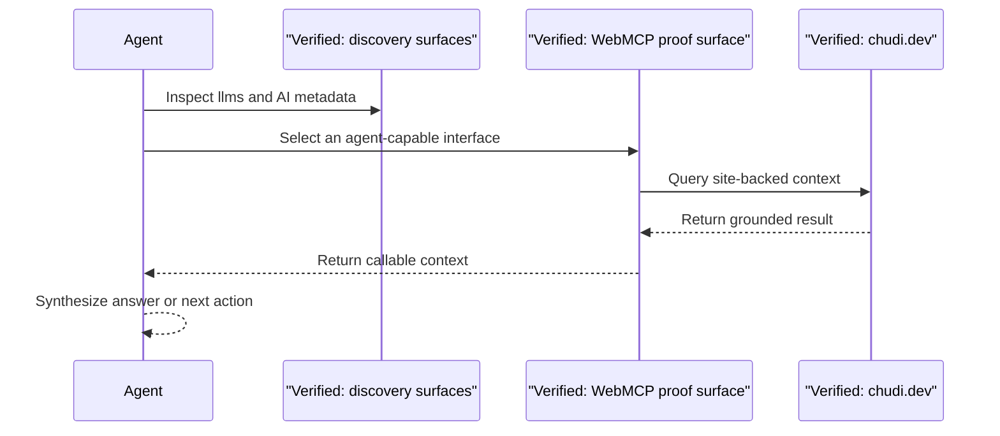

# Verified Agent Query Sequence

- This diagram stays close to what is publicly evidenced: discovery, a documented WebMCP layer, and site-backed results.
- It avoids claiming private tool implementation details that are not visible from the repo.
- The agent layer is useful because it reduces the need for UI scraping.
