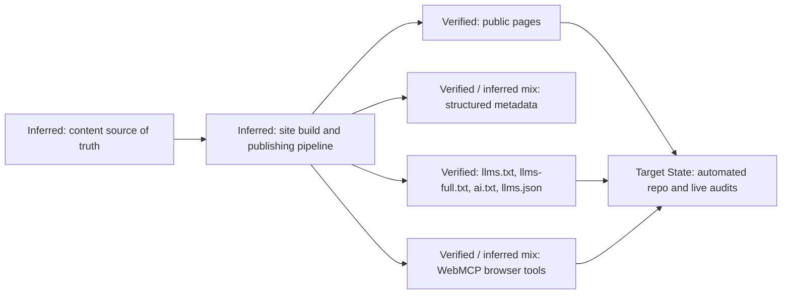

# Conceptual Content-to-Surface Pipeline

- The pipeline explains the pattern, not a fully proven private implementation.
- The important rule is shared derivation: pages, metadata, discovery files, and tools should flow from the same facts.
- The audit loop exists to catch divergence after publication.
