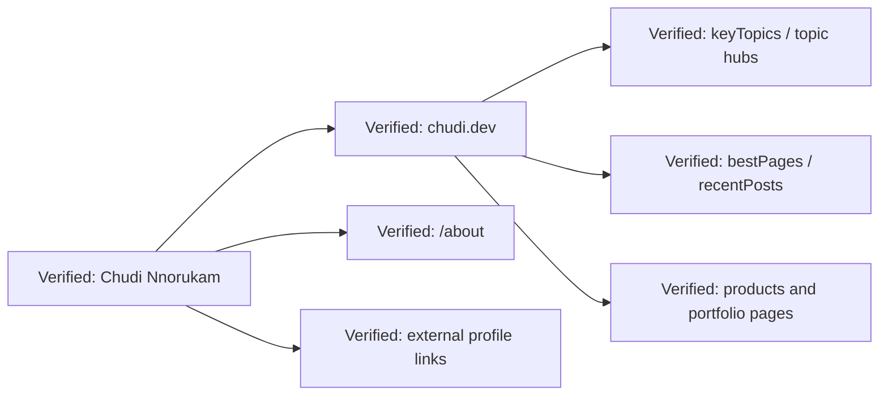

# Verified Identity Graph

- The identity graph shows how the site can be treated as a coherent knowledge node instead of a disconnected archive.
- The node set is derived from public metadata and public pages, not hidden internals.
- This is the minimum shape needed for machine-readable identity and authority concentration.
