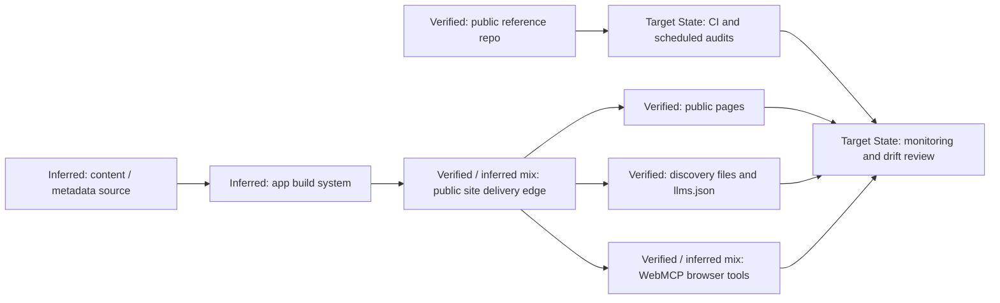

# Target State Infrastructure and Delivery Topology

- This is a target-state operating topology rather than a claim about hidden infrastructure details.
- It visualizes the control loop between the live site, the public repo, and the verification system.
- The repo becomes part of the operational system by documenting and checking the contract.
