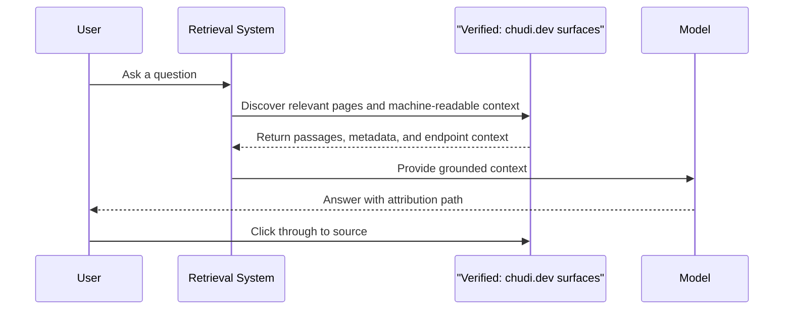

# Verified Retrieval and Citation Sequence

- This sequence captures the retrieval behavior the repo argues for.
- The critical property is not just ranking, but grounded answer generation with a credible citation path.
- Public machine-readable surfaces reduce brittle extraction and improve traceability.
