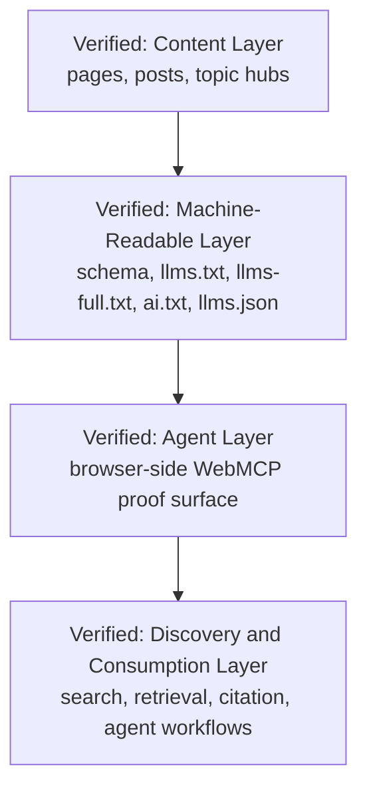

# Verified Surface Contract Stack

- The stack shows how the repo frames `chudi.dev` as more than a page collection.
- The machine-readable layer mediates between visible content and downstream retrieval systems.
- The agent layer builds on the same public authority rather than replacing it.
