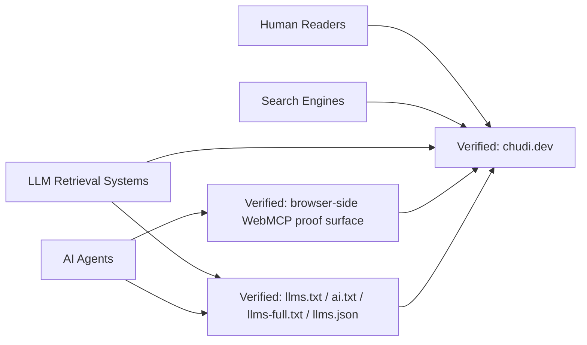

# Verified System Context Map

- This is the public system boundary the repo can defend today.
- Humans, search systems, LLM retrieval systems, and agents all touch the same domain through different surfaces.
- The machine-readable and agent-facing layers are not abstract theory here; they are part of the verified public surface set.
