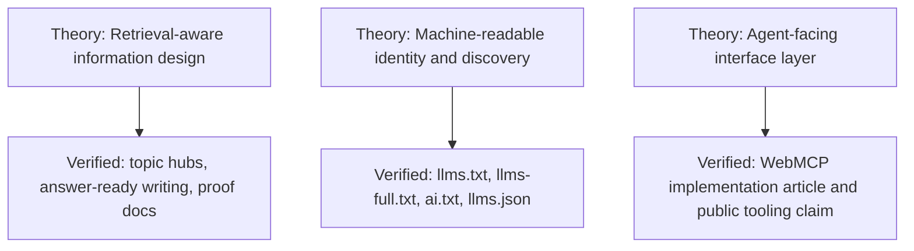

# Theory-to-Implementation Map

- This diagram is the bridge between the whitepaper and the live public implementation.
- Each theory layer is mapped to a concrete `chudi.dev` artifact the repo can point at.
- It keeps the repo anchored in evidence while still explaining the larger pattern.
